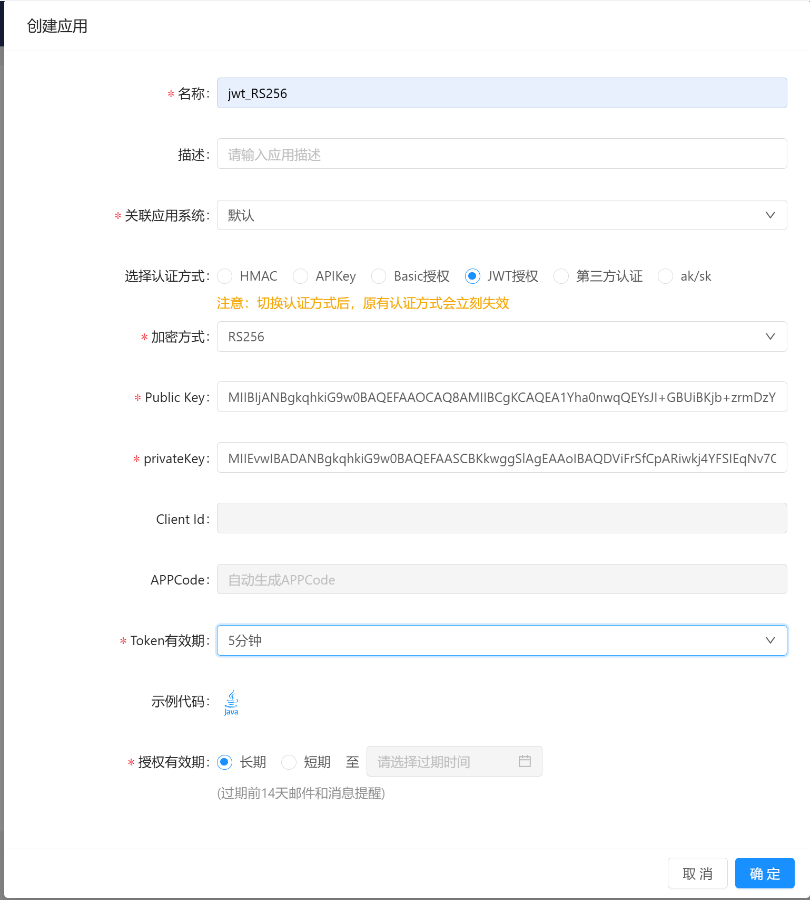
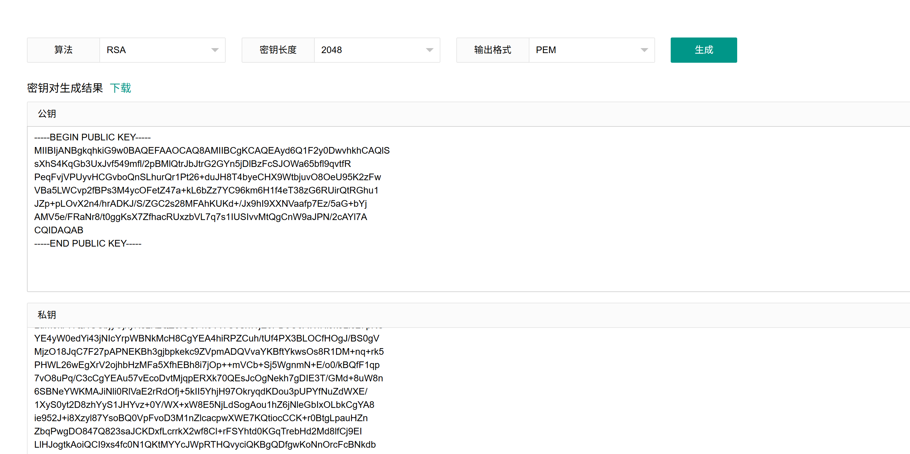
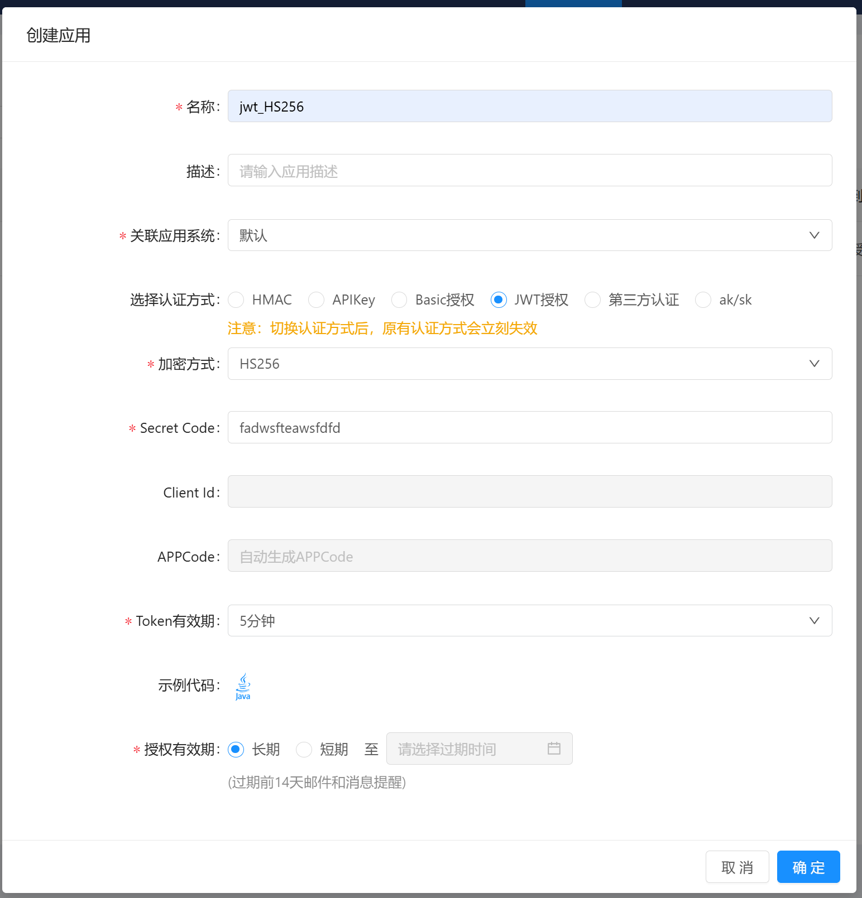

# JWT认证SDK使用说明

Python版本的SDK，用于生成Orchsym API Gateway JWT 认证所需的token。

支持 Python 3。

### JWT简介

> JWT(全称：Json Web Token)是一个开放标准(RFC 7519)，它定义了一种紧凑的、自包含的方式，用于作为JSON对象在各方之间安全地传输信息。该信息可以被验证和信任，因为它是数字签名的。

### RS256加密方式

#### 创建应用

> 注意：上述创建jwt_RS256应用所需的Public Key和privateKey，可以运行代码RSAGenerator.py进行生成，或者使用[在线生成工具](https://www.lddgo.net/encrypt/rsakey)进行生成。（将生成后的结果拷贝到文本编辑器后，先进行合并行，再移除文件中的空白符号即可）

如上述生成的结果，处理后的结果为：

公钥：
`MIIBIjANBgkqhkiG9w0BAQEFAAOCAQ8AMIIBCgKCAQEAyd6Q1F2y0DwvhkhCAQlSsXhS4KqGb3UxJvf549mfl/2pBMlQtrJbJtrG2GYn5jDlBzFcSJOWa65bfl9qvtfRPeqFvjVPUyvHCGvboQnSLhurQr1Pt26+duJH8T4byeCHX9WtbjuvO8OeU95K2zFwVBa5LWCvp2fBPs3M4ycOFetZ47a+kL6bZz7YC96km6H1f4eT38zG6RUirQtRGhu1JZp+pLOvX2n4/hrADKJ/S/ZGC2s28MFAhKUKd+/Jx9hI9XXNVaafp7Ez/5aG+bYjAMV5e/FRaNr8/t0ggKsX7ZfhacRUxzbVL7q7s1IUSIvvMtQgCnW9aJPN/2cAYl7ACQIDAQAB`

私钥：
`MIIEvwIBADANBgkqhkiG9w0BAQEFAASCBKkwggSlAgEAAoIBAQDJ3pDUXbLQPC+GSEIBCVKxeFLgqoZvdTEm9/nj2Z+X/akEyVC2slsm2sbYZifmMOUHMVxIk5Zrrlt+X2q+19E96oW+NU9TK8cIa9uhCdIuG6tCvU+3br524kfxPhvJ4Idf1a1uO687w55T3krbMXBUFrktYK+nZ8E+zczjJw4V61njtr6QvptnPtgL3qSbofV/h5PfzMbpFSKtC1EaG7Ulmn6ks69fafj+GsAMon9L9kYLazbwwUCEpQp378nH2Ej1dc1Vpp+nsTP/lob5tiMAxXl78VFo2vz+3SCAqxftl+FpxFTHNtUvuruzUhRIi+8y1CAKdb1ok83/ZwBiXsAJAgMBAAECggEBAJS0XDHkN/XHcCbWEbEbwguznDGdzFxMkwGmyDD9PeBD3n8FIW0D47uyi6obTqb2O7BZvyZDehomnYVxGnwtFRksKotcT+vvorVkZqyxRF/sx/Lo69EvRiTjOaXPX78NpAuHpzM9yi8XQgl8Bd6EA8Ad4Rk5UQvblXIDPjvSqECiCG7W3dmQ6VnI/6zfHo2IRNEAHN8es3hoygwte11unp1wrmY2wXuHbbLhC3pZJKs3/Hk5bJErnXY7OgHAf8e/sGmgEi15ef4C94c3+o+0dMqdle1SBKhKK+Upvn+NG5KtJ+d1KtVWRjhiqRrDkIHqOYG3tMTni7oO+9YZYNIQT6UCgYEA5JG0qdWUHUU0ICdExSBttqLe4QmRHSu2ahas8oa+xnxd//E8Pyih/tWNBIhz2YZ+bM+iY+FWx1bvveWPLumokPl4QHGCbjyOjxyNsLKzQZoICCPn5VWGcSxWjE0PDoO5AWfHiJk8Ll027pKUYE4yW0edYi43jNIcYrpWBNkMcH8CgYEA4hiRPZCuh/tUf4PX3BLOCfHOgJ/BS0gVMjzO18JqC7F27pAPNEKBh3gjbpkekc9ZVpmADQVvaYKBftYkwsOs8R1DM+nq+rk5PHWL26wEgXrV2ojhbHzMFa5XfhEBh8i7jOp++mVCb+Sj5WgnmN+E/o0/kBQfF1qp7vO8uPq/C3cCgYEAu57vEcoDvtMjqpERXk70QEsJcOgNekh7gDIE3T/GMd+8uW8n6SBNeYWKMAJiNli0RlVaE2rRdOfj+5kII5YhjH97OkryqdKDou3pUPYfNuZdWXE/1XyS0yt2D8zhYyS1JHYvz+0Y/WX+xW8E5NjLdSogAou1hZ6jNleGbIxOLbkCgYA8ie952J+i8Xzyl87YsoBQ0VpFvoD3M1nZlcacpwXWE7KQtiocCCK+r0BtgLpauHZnZbqPwgDO847Q823saJCKDxfLcrrkX2wf8Cl+rFSYhtd0KGqTrebHd2Md8lfCj9EILlHJogtkAoiQCI9xs4fc0N1QKtMYYcJWpRTHQvyciQKBgQDfgwKoNnOrcFcBNkdb5U89sbvrwyeZj4YmRctL5qcdb3BjoT2yObItWM4nzoW7h897eMGvkEA/BnD6i1J8yDLoREFa0BEHCafdvYSSjiXjADw1tyGZT05R71b3SCpcuiC3nOoeUOka8ApuFqeoviQ8jNQfrZ93am6/Z3X/Kv5OMw==`

#### 调用测试

创建app后，即可使用`test_rs256_request.py`测试代码进行调用测试。注意修改代码中的以下变量为新建的app的实际值：
- app_code：对应编辑app页APPCode字段
- client_id：对应编辑app页Client Id字段
- private_key：对应编辑app页privateKey字段
- token_period：对应编辑app页Token有效期，单位是秒，建议比创建app时指定的token有效期要短一些，比如Token有效期是10min，这里就设置为8min或者5min，如果有报错，则需要核实双方的时间一致性。网关会判断，如果Token有效期是5min，但你生成token时，设置的有效期是6min，则永远无法通过校验，因为网关不允许客户端生成的token有效期比app的token有效期长。
- url: 发布的实际接口调用地址，默认是get方法，如果是post调用，需自行修改代码。

### HS256加密方式

#### 创建应用

> 上述创建app时需要的`Secret Code`自定义即可，但必须为8~16位的英文字符串。不支持特殊符号或者数字。

#### 调用测试

创建app后，即可使用`test_hs256_request.py`测试代码进行调用测试。注意修改代码中的以下变量为新建的app的实际值：
- app_code：对应编辑app页APPCode字段
- client_id：对应编辑app页Client Id字段
- secret_code：对应编辑app页secretCode字段
- token_period：对应编辑app页Token有效期，单位是秒，建议比创建app时指定的token有效期要短一些，具体原因参考代码中的注释。
- url: 发布的实际接口调用地址，默认是get方法，如果是post调用，需自行修改代码。